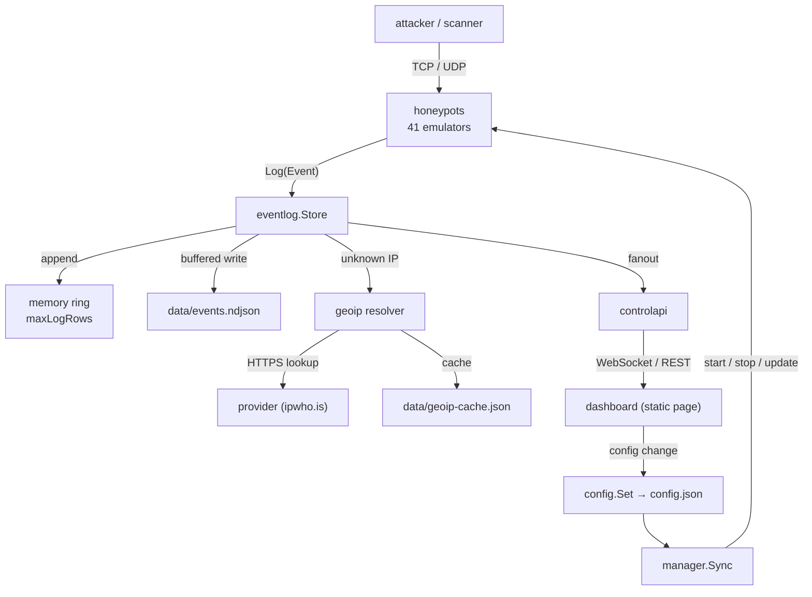

# Architecture of the Go daemon

The daemon is one static binary with no database, no CGO and three
third-party libraries (`gliderlabs/ssh`, `gorilla/websocket`,
`golang.org/x/crypto`). It opens decoy ports, records what arrives, and
exposes that over an authenticated control API. The dashboard is a
separate static page that connects to it — the daemon never serves UI.

- Module: `github.com/h4ux/honeystack/go-honeypot/server`
- Entry point: [`go-honeypot/server/main.go`](../go-honeypot/server/main.go)
- Go 1.25+ (floor set by `golang.org/x/crypto`), dependencies vendored

For where bytes end up on disk, see [storage.md](./storage.md). For adding
a protocol, see [CONTRIBUTING.md](../CONTRIBUTING.md#adding-a-honeypot-service).

## Packages

```
server/
├── main.go                  wiring: flags → config → store → geoip → manager → API
└── internal/
    ├── config/              JSON defaults + user overrides, atomic writes
    ├── eventlog/            the event ring, NDJSON log, sessions, stats
    ├── geoip/               IP → country, cached on disk
    ├── manager/             starts/stops listeners to match the config
    ├── controlapi/          WebSocket + REST, auth-key gated
    └── honeypots/           the 41 protocol emulators + TCP/UDP bases
```

Dependencies point one way: `honeypots` and `controlapi` depend on
`eventlog` and `config`; `eventlog` depends on nothing but the standard
library (it takes `geoip` through a small interface, so it has no import
of that package). Nothing depends on `main`.



## Startup sequence

`main.go` does exactly this, in order:

1. **Parse flags** — `--config`, `--defaults`, `--version`. Both paths are
   made absolute so the daemon does not depend on its working directory
   after start.
2. **`config.Init(defaults, user)`** — read `config.default.json`, then
   merge `config.json` over it (creating it from the defaults on first
   run). Merge is field-wise and only non-zero values override, which is
   why `geoip` is a pointer: a value type could not express
   `"enabled": false`.
3. **`eventlog.NewWithOptions`** — open the NDJSON log, replay its tail
   into the ring, start the flusher goroutine.
4. **Subscribe the stdout mirror** — filtered by `storage.stdoutEvents`
   (`important` by default; see [storage.md](./storage.md#the-journal)).
5. **`geoip.New`** — load the cache from disk, start the lookup worker and
   the cache flusher. Attached to the store with `store.SetGeo`.
6. **`manager.New` + `registerHoneypots`** — build the factory registry
   (one `m.Register("name", factory)` per protocol) and set the fallback
   used for services the config names but the registry does not know
   (generic TCP/UDP capture).
7. **`mgr.Sync(cfg)`** — start every enabled listener.
8. **`controlapi.GenerateAuthKey`** — 32 random bytes, hex-encoded, written
   to `data/auth.key` (0600). A new key every start, by design.
9. **`api.Start`** — bind the control port, serve `/api` (WebSocket) and
   `/v1/*` (REST).
9b. **`tracker.Start`** — begin polling the public IP, refresh the DynDNS
   record, and publish the systemd status line (`sd_notify`) that
   `systemctl status` prints.
10. **Wait for SIGINT/SIGTERM**, then shut the API down with a 5-second
    timeout; deferred calls stop listeners, flush the log and save the
    geo cache.

## The hot path: one probe becomes one event

```
accept()                        honeypots/base.go   (TCP) or generic.go (UDP)
  └─ OpenSession()              eventlog: session row, capped table
  └─ handler(conn)              the protocol emulator, e.g. mail.go
       └─ store.Log(Event{…})   eventlog:
            ├─ capDetails()       truncate captured detail to maxDetailBytes
            ├─ geo annotate        from cache; queue a lookup on a miss
            ├─ ring append         evict oldest past maxLogRows
            ├─ session counters    command count, first-hit-this-run
            ├─ json.Marshal → buffered write → data/events.ndjson
            └─ fanout()            every subscriber: WS clients + stdout mirror
  └─ CloseSession()             marks ClosedAt (the row stays, prunable)
```

`Log` holds the store's write lock for the ring append and the buffered
write; the actual `write(2)` happens on the flusher goroutine every 500 ms.
Subscriber fanout happens **outside** the lock, and each subscriber call is
wrapped in a `recover`, so one slow or panicking dashboard client cannot
stall or crash ingestion.

## Listener lifecycle

`manager.Sync(cfg)` is the only thing that starts or stops a listener, and
it is idempotent — the dashboard calls it after every config change:

| Config vs. running | Action |
|---|---|
| enabled, not running | build from the factory, `Start()` |
| enabled, running, same port | `UpdateConfig()` — no restart, so banners and fake-auth changes apply live |
| enabled, running, port changed | `Stop()` then `Start()` |
| disabled, running | `Stop()` |
| unknown name | the fallback factory: generic TCP or UDP capture |

Each listener's status (running, port, last error) is what the dashboard's
Services tab shows; a port that cannot bind (`:53` under
`systemd-resolved`, `:25` under Postfix) is reported per service and does
not stop the rest.

### The two bases

Every emulator is built on one of two types in `internal/honeypots`:

- **`TCP`** (`base.go`) — accept loop, one goroutine per connection, idle
  deadline (`idleTimeoutSec`, 60 s default), session open/close, and a
  `recover` per connection that logs a `handler_error` event instead of
  taking the process down. The emulator only implements
  `func(ctx, conn, sessionID, meta)`.
- **`UDP`** (`generic.go`) — single read loop; the emulator implements
  `func(payload, meta) UDPReply` and returns what to log and what to send
  back. Sessions are grouped per source for a 2-minute window rather than
  created per datagram, and replies are never larger than the request.

Both hold their config behind a mutex because `UpdateConfig` runs on the
manager's goroutine while handlers are reading it.

## Concurrency map

| Goroutine | Count | Lifetime |
|---|---|---|
| TCP accept loop | one per TCP listener | until `Stop()` |
| TCP connection handler | one per connection | until close or idle timeout |
| UDP read loop | one per UDP listener | until `Stop()` |
| eventlog flusher | 1 | process |
| pubaddr poller | 1 (when `dyndns.enabled`) | process |
| geoip worker + cache flusher | 2 | process |
| HTTP server (control API) | 1 + one per request | process |
| WebSocket client | reader + ping writer per client | until disconnect |

Locks, in the order you will meet them:

| Lock | Guards |
|---|---|
| `config.mu` | the current config and the user path |
| `Store.mu` (RWMutex) | ring, session table, NDJSON writer, run counters |
| `Store.statsMu` | the cached aggregate (`statsCacheMs`) |
| `Store.subMu` | subscriber map (taken briefly, released before fanout) |
| `Store.geoMu` | the attached geo resolver |
| `geoip.mu` / `pendMu` | cache map / in-flight lookups |
| `manager.mu` | registry + running services |
| `TCP.mu`, `UDP.mu`, `UDP.sessMu`, `WebAPI.mu` | per-listener config, UDP session window |

There is no lock ordering hazard because no path takes two of these at
once — `Log` releases `Store.mu` before fanout, and `Stats` computes under
`Store.mu` but is entered through `statsMu`.

## Control API

Two front doors over the same data, both gated on the per-run auth key
(query `?token=`, `X-Auth-Key`, or `Authorization: Bearer`), compared with
a constant-time check:

- **WebSocket `/api`** — the dashboard's normal path. On connect the server
  sends a `hello` (config, services, stats, recent events, build info, geo
  status) and then streams every event. Requests are `{type, reqId,
  payload}`; replies carry the same `reqId`.
- **REST `/v1/*`** — `hello`, `events`, `range`, `sessions`, `session`,
  `stats`, `services`, `config`, `geo`, `version`, plus unauthenticated
  `/health`. Used by the HTTPS relay (a page served over TLS cannot open
  `ws://`) and by anything scripting the daemon.

`update_config` / `PUT /v1/config` writes the file and calls
`manager.Sync`, which is how a dashboard toggle becomes a listener change.

## Design constraints worth knowing

- **Nothing is executed.** Fake shells print canned output; the proxy, mail
  and VPN emulators never forward, relay or tunnel; UDP replies are never
  larger than the request so nothing can be used as an amplifier.
- **Everything is bounded.** Ring size, session table, per-event capture,
  NDJSON size and the geo cache all have caps — see
  [storage.md](./storage.md#limits-and-what-they-cost).
- **All reads are bounded** and every handler is panic-isolated: attacker
  input decides how much work happens, so it decides how much it can cost.
- **The dashboard is untrusted output.** Every field is attacker
  controlled, so it is escaped on render and clamped for display.
